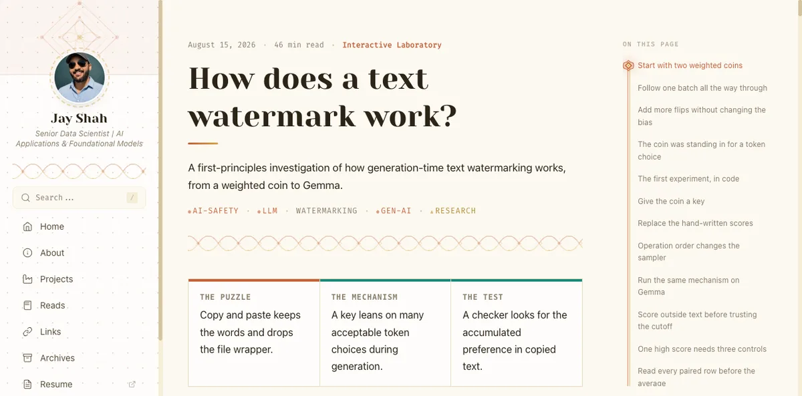
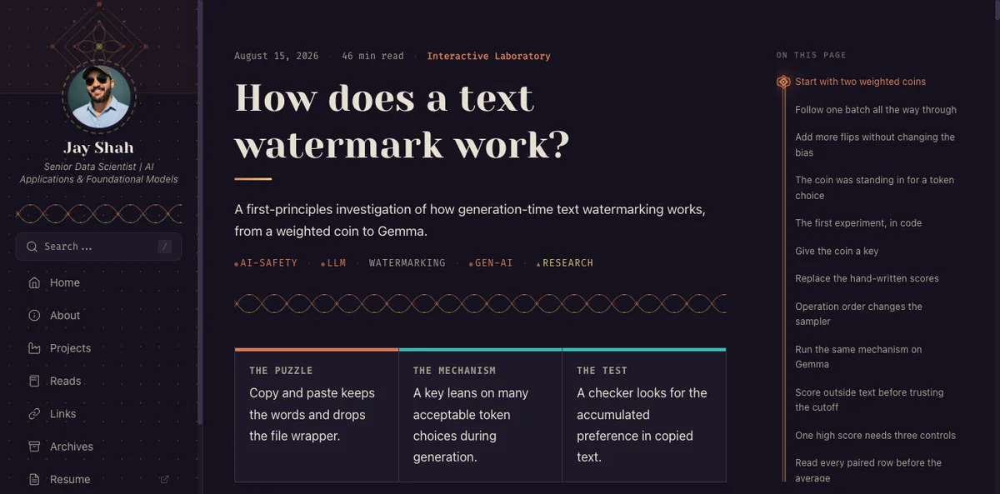
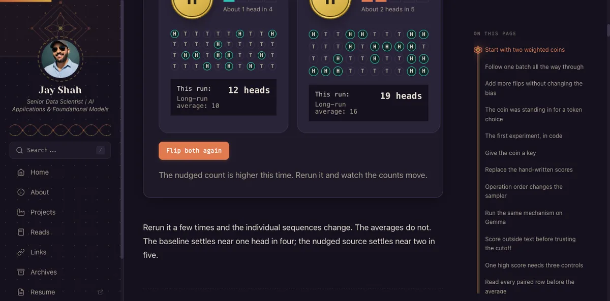
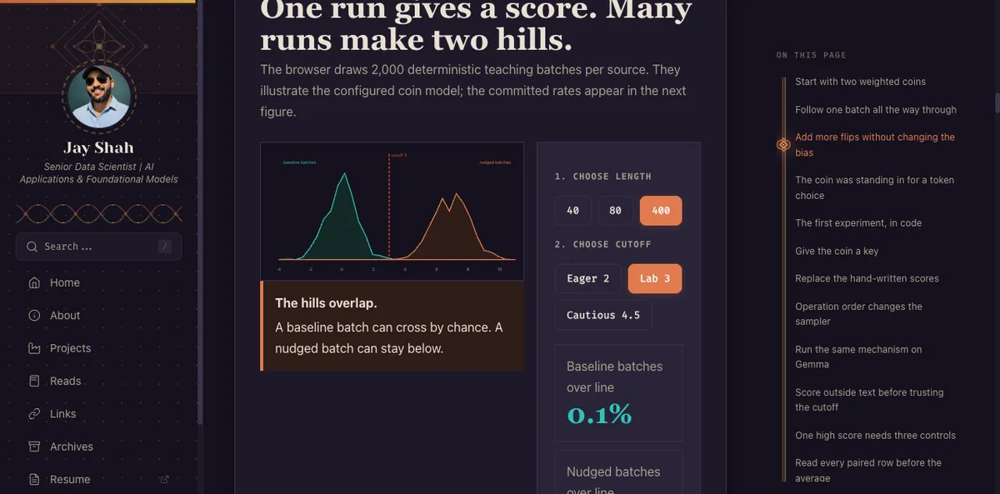

# jayshah5696.github.io

Personal blog, research lab, and portfolio built with [Astro 7](https://astro.build), [Tailwind CSS 4](https://tailwindcss.com), and a custom Indian-inspired design system (**"Vav"**) rooted in Kolam and Rangoli geometry.

**Live Site:** [https://jayshah.dev](https://jayshah.dev)

---

## 📸 Visual Design & Previews

### Light Mode (Kolam) & Dark Mode (Rangoli)
| Light Mode (Kolam Cream Paper & Brown Ink) | Dark Mode (Rangoli Indigo Night & Vivid Accents) |
| :---: | :---: |
|  |  |

### First-Class Interactive Laboratories ("Vav Interactive")
| Clickable Coin Flip Simulation | 2,000-Batch Distribution Histogram |
| :---: | :---: |
|  |  |

---

## Features

- **Custom "Vav" Design System**: 
  - **Light mode (Kolam)**: Warm cream paper (`#fdf9f1`), dark brown ink text (`#2c2416`), delicate geometric knot line art.
  - **Dark mode (Rangoli)**: Deep indigo night (`#15111e`), cream silk text (`#e8e0d4`), vibrant colorful accents.
- **Vav Interactive Architecture**: Native support for rich data-heavy, simulation-heavy, and dashboard-based posts with interactive widgets, SVG animations, and dynamic controls.
- **Stepped Table of Contents & Scrollspy**: Right sidebar with active Kolam diamond rail tracking, smooth anchor scrolling, and top reading progress bar.
- **SVG Geometry**: Procedurally generated inline SVG patterns for borders, corners, and hero elements.
- **Color-coded Tags**: Semantic categorization with shape indicators (`terra ●` for AI, `mor ◆` for dev tools, `gold ▲` for ML, `kumkum ✦` for personal).
- **Full-text Search**: Static full-text search powered by Pagefind with `/` keyboard shortcut.
- **Ultra-wide Support**: Centered cohesive layout on monitors wider than 1536px.
- **View Transitions**: Smooth app-like client navigation while preserving dark/light theme state.
- **Reading Enhancements**: Scroll progress bar, accurate calculated reading time (`reading-time`), floating table of contents.
- **Developer Tools**: One-click copy buttons on code blocks with Shiki syntax highlighting.
- **Giscus Comments**: GitHub Discussions-powered comments on all posts.
- **SEO & Structured Data**: JSON-LD (`BlogPosting`, `Person`), Open Graph, Twitter Cards, auto-generated sitemap, and RSS feed.
- **Automated Task Runner (`just`)**: One-command building, local previewing, interactive blog publishing, and headless browser verification.

---

## Quick Start & `just` Automation

We use [`just`](https://github.com/casey/just) for consistent, cross-platform workflow automation:

```bash
# List all available commands
just

# Start development server (localhost:4321)
just dev

# Build with the current local dependencies
just build

# Reproduce the GitHub Pages build from a clean lockfile install
just ci-build

# Preview production build locally
just preview
```

*(You can also use standard `npm run dev`, `npm run build`, and `npm run preview`.)*

---

## Publishing Interactive Blog Posts

Interactive, simulation-heavy, or dashboard-based blog posts are first-class citizens in this codebase:

```bash
# Publish an interactive HTML post directly into the content collection:
just publish-interactive <source_html_path> <slug> [tags] [date]

# Example:
just publish-interactive /path/to/watermark-report.html how-text-watermarks-hide-in-plain-sight "ai-safety,llm,watermarking,gen-ai,research" "2026-08-16"

# Run automated browser verification & capture Light/Dark screenshots:
just verify-post how-text-watermarks-hide-in-plain-sight
```

### How Interactive Posts Work Under the Hood:
1. **Schema flag:** Set `interactive: true` in frontmatter in `src/content/blog/<slug>.md`.
2. **Layout Routing:** `src/pages/posts/[...slug].astro` automatically routes `interactive: true` posts to `InteractivePostLayout.astro` (wide canvas, responsive layout, Right Sidebar Table of Contents).
3. **Token Adapter:** `src/styles/interactive-theme.css` maps generic visualization CSS variables (`--bg`, `--surface`, `--border`, `--orange`, `--blue`, `--green`, `--yellow`, `--red`) to Vav tokens in both Kolam and Rangoli modes.
4. **Script Execution:** Full simulation JavaScript is injected via `<script is:inline>` and initialized idempotently across Astro page loads.

For more details, see [docs/publishing-interactive-blogs.md](docs/publishing-interactive-blogs.md).

---

## Standard Blog Posts

Create a markdown file in `src/content/blog/<slug>.md`:

```markdown
---
title: "Your Post Title"
date: 2026-05-15
description: "A short description for cards and search snippets."
image: /assets/images/your-hero.webp  # optional (use WebP)
tags:
  - llm
  - rag
series: "RAG Deep Dive"     # optional — groups related posts
seriesOrder: 1               # optional — ordering within series
draft: false                 # set true to hide from production
interactive: false           # default false; set true for interactive posts
---

Your content here...
```

---

## 📖 Curated Reads & Karakeep Automation

The `/reads/` timeline showcases curated links, papers, and engineering deep dives with structured takeaways and color-coded tags.

### 1. Automated Karakeep Sync & LLM Curation (`just sync-reads`)

To harvest recent bookmarks from Karakeep, synthesize takeaways with LLMs, review in an interactive UI, and open a GitHub PR:

```bash
# Auto-detect all new bookmarks since latest read in repo (defaults to openai/gpt-5.6-luna)
just sync-reads

# Sync from a specific date onwards
just sync-reads 2026-08-15

# Sync a specific date range
just sync-reads 2026-08-15 2026-08-27

# Use a custom OpenRouter model slug (e.g. Gemini Flash Lite)
just sync-reads 2026-08-15 2026-08-27 google/gemini-3.5-flash-lite
```

#### How the Pipeline Works:
1. **Karakeep API Harvest:** Connects to your self-hosted Karakeep bookmark manager via API credentials in `~/.zshrc`.
2. **Noise & Duplicate Filtering:** Strips localhost links, duplicates, and links already published in `src/content/reads/`.
3. **arXiv Resolution:** Fetches verified paper titles and abstracts from the official arXiv API.
4. **Dynamic Tagging & Pydantic Validation:** Dynamically extracts the site's canonical taxonomy from `src/utils/tags.ts` (zero hardcoding) and validates the structured LLM output using `pydantic`.
5. **Parallel LLM Synthesis:** Analyzes articles via OpenRouter (`openai/gpt-5.6-luna` with automatic fallback to `google/gemini-3.5-flash-lite`) to generate 1-sentence overviews + 2–3 technical bullet points.
6. **Interactive Local Web UI (`http://127.0.0.1:4999`):** Review candidate cards, toggle tag chips, refine notes, and check/uncheck items.
7. **Automated Pull Request:** On submit, the script switches to `master`, branches (`feat/reads-sync-...`), writes markdown files, verifies the Astro build + Pagefind indexing, commits, pushes, and creates a GitHub Pull Request via `gh pr create`.

### 2. Manual Single Read Addition

To manually log an individual read to `/reads/`:
```bash
just add-read "https://example.com/article" "ai-safety,llm" "Custom Article Title"
```

---

## Project Structure

```
.
├── justfile                         # Automation task runner recipes
├── docs/
│   └── publishing-interactive-blogs.md # Guide to interactive blog pipeline
├── scripts/
│   ├── curate_reads.py              # LLM-powered Karakeep reads curator & PR builder (uv run)
│   ├── publish-interactive.js       # HTML to Vav interactive blog publisher
│   ├── verify-post.js               # Automated headless browser verification
│   └── add-read.js                  # CLI helper to add reading notes
├── src/
│   ├── components/                  # Reusable Astro UI components
│   │   ├── Sidebar.astro            # Desktop sidebar with nav & search
│   │   ├── MobileNav.astro          # Mobile header & drawer
│   │   ├── PostCard.astro           # Blog post card in lists
│   │   ├── RightSidebar.astro       # Recent posts & tag cloud
│   │   ├── TagList.astro            # Color-coded tags
│   │   ├── Search.astro             # Pagefind modal dialog
│   │   ├── JsonLd.astro             # JSON-LD structured data
│   │   └── Giscus.astro             # GitHub Discussions comments
│   ├── layouts/
│   │   ├── BaseLayout.astro         # Root HTML layout & theme engine
│   │   ├── PostLayout.astro         # Standard post layout with TOC
│   │   └── InteractivePostLayout.astro # Wide-canvas interactive post layout
│   ├── pages/                       # Astro file-based routes
│   ├── content/
│   │   ├── blog/                    # Blog collection (.md files)
│   │   └── reads/                   # Reading list entries
│   ├── styles/
│   │   ├── global.css               # Vav core design tokens & patterns
│   │   └── interactive-theme.css    # Simulation & interactive adapters
│   ├── utils/tags.ts                # Centralized tag colors & metadata
│   └── content.config.ts            # Content collection schema
└── public/
    └── assets/images/               # Optimized WebP assets
```

---

## Design System: "Vav" (Kolam & Rangoli)

The visual identity fuses two traditional Indian art forms:

- **Light Mode (Kolam):** Warm cream paper (`#fdf9f1`), dark brown ink text (`#2c2416`), delicate woven knot patterns.
- **Dark Mode (Rangoli):** Deep indigo night (`#15111e`), cream silk text (`#e8e0d4`), vibrant colorful accents.

### Color Tokens

| Token    | Usage                                  |
|----------|----------------------------------------|
| `cream`  | Light mode surfaces, borders (`#fdf9f1` base) |
| `night`  | Dark mode surfaces, cards (`#15111e` base)    |
| `terra`  | Primary accent (terracotta). Links, AI tags  |
| `mor`    | Peacock teal. Dev tool tags                   |
| `gold`   | Turmeric yellow. ML tags, decorative nodes   |
| `kumkum` | Vermilion red. Personal tags                  |
| `ink`    | Light mode text hierarchy (`#2c2416` dark ink)|
| `silk`   | Dark mode text hierarchy (`#e8e0d4` silk)    |

---

## Tech Stack

- **Astro 7** — static site generator with zero-JS baseline
- **Tailwind CSS 4** — modern CSS engine with custom Vav design tokens
- **Pagefind** — fast static full-text search indexed at build time
- **Shiki** — syntax highlighting with code block copy buttons
- **reading-time** — accurate per-post reading time calculations
- **Giscus** — GitHub Discussions-backed commenting system
- **Just** — concise task runner for dev, build, publishing, and verification

---

## Deployment

This site is deployed to **GitHub Pages** with custom domain [`jayshah.dev`](https://jayshah.dev).

Deployment is automated by `.github/workflows/deploy.yml`. Pull requests to `master` run the clean build job without deploying. Pushes to `master` run the same build and then deploy it.

Before merging dependency, Astro configuration, integration, or build-pipeline changes, run:

```bash
just ci-build
```

This command matches the workflow's build steps: `npm ci --legacy-peer-deps` followed by `npm run build`. Unlike `just build`, it replaces local dependencies with the versions in `package-lock.json`, so it catches missing direct dependencies and lockfile drift that a warm `node_modules` directory can hide.
