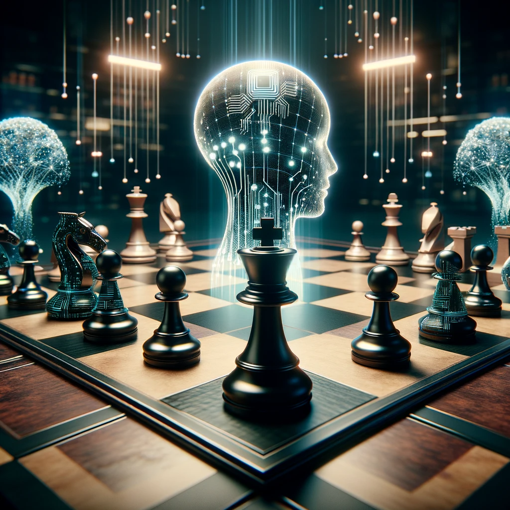

## AI and Prompt Injection: The Chessboard of Hidden Moves

In the intricate world of artificial intelligence, understanding prompt injection can be likened to a game of chess, but with a twist: there are hidden moves.

Imagine AI as a chess player, trained and adept in the game's rules and strategies. Each standard prompt given to the AI is akin to a conventional chess move, anticipated and countered based on years of learning and patterns. The AI, like a seasoned chess player, responds with well-thought-out moves, anticipating outcomes and strategizing accordingly.

Enter prompt injection – the hidden moves in our chess analogy. These are the unexpected, unorthodox moves that aren't part of the AI's training. They're like a pawn moving diagonally without capturing, or a bishop sliding only one square. These moves don't align with the conventional rules the AI has learned. In response, the AI must make a decision – to adhere rigidly to its training or to adapt to this new, unforeseen challenge.

This is where the true test of AI's adaptability and resilience comes into play. In some cases, the AI might falter, unable to reconcile these new moves with its programming. But in other instances, it might demonstrate an impressive ability to adapt, to find new strategies and pathways that weren't explicitly taught.

The metaphor of chess with hidden moves beautifully encapsulates the dynamic and often unpredictable nature of interacting with AI. It highlights the importance of designing AI systems that are not just knowledgeable but also adaptable, capable of handling the unexpected with as much grace as they handle the routine.

In this game of AI chess, the hidden moves prompt us to think differently, challenge our assumptions, and push the boundaries of what AI can do. They remind us that the path to AI maturity is not just about teaching it the rules of the game but also about preparing it for the moves that are yet to be defined.
