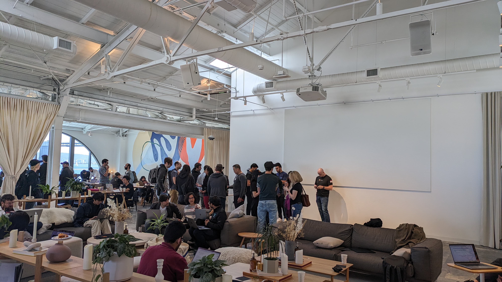

Hello everyone,  

Today, I want to share my **personal experience** of participating in hackathons, specifically the [Mistral Hackathon in San Francisco]([https://mistralsf.devpost.com/](https://mistralsf.devpost.com/ "https://mistralsf.devpost.com/")). This event was a **fascinating journey**, filled with learning, networking, and a lot of fun.

The Mistral Hackathon was a **grand event**, boasting around 400 participants. The event attracted a diverse crowd, thanks to the involvement of big names like [Mistral](https://chat.mistral.ai/chat), [Nous Research](https://huggingface.co/NousResearch), [Groq](https://console.groq.com/), and others. The atmosphere was electric, with participants eager to build and create. While some were there to compete, others were there just to soak in the vibe and enjoy the free food.

Hackathons, in my view, are not just team sports. They are a competition where individuals and teams strive to outdo each other. The **judging criteria** are often defined, but the judges' biases can sometimes influence the outcome too.

One of the **key aspects** of a successful hackathon experience is **team building**. It's crucial to strategically choose your team members. Sometimes, luck plays a vital role in this process. You might end up with a team member who brings a brilliant idea to the table or possesses unique skills.

I recall a hackathon that took place last weekend. I couldn't participate due to health reasons, but the team I was supposed to join ended up winning the third prize. Their project was impressive, and the groundwork had started even before the hackathon. This highlights the importance of **preparation and brainstorming** before the event.

Another crucial factor that contributes to a successful hackathon experience is the **support provided by the event organizers or sponsors**. At the Mistral Hackathon, we were provided with a stable internet connection and access to various APIs, which made our lives easier.

Working in a team can be a learning experience in itself. Everyone has different working styles and tools, and it's interesting to see how these differences play out during the hackathon. Some people need clear directions, while others thrive in a more flexible environment.

Looking back at my hackathon journey, I can say it has been a **rewarding experience**. I participated in my first hackathon six years ago, in 2018. Back then, I felt unsure about my abilities. But once I stepped into the arena, the competitive spirit took over.

Hackathons are also a great place to **network and learn from others**. At the Mril Hackathon, I had the opportunity to meet many people I admire, like [Teknium](https://twitter.com/Teknium1) (Ryan) from Nous Research, Wing Lian developer of Axolotl, Jerry from LlamaIndex, Charles ( creator of Mergekit), Swyx from latent space podcast, Sunny Madra from Groq. It was inspiring to see these individuals, who I usually follow on Twitter, in person. They were approachable and just like us, which was a refreshing experience.

In conclusion, participating in a hackathon is a **unique experience** that offers numerous learning opportunities. It's a chance to build something, to compete, and to learn from others. It's a place where you can meet like-minded individuals and learn from their experiences. So, if you're a developer or an engineer, I highly recommend participating in a hackathon. It's an experience that can help you grow both personally and professionally.

[Project link](https://devpost.com/software/neurobuddy)
