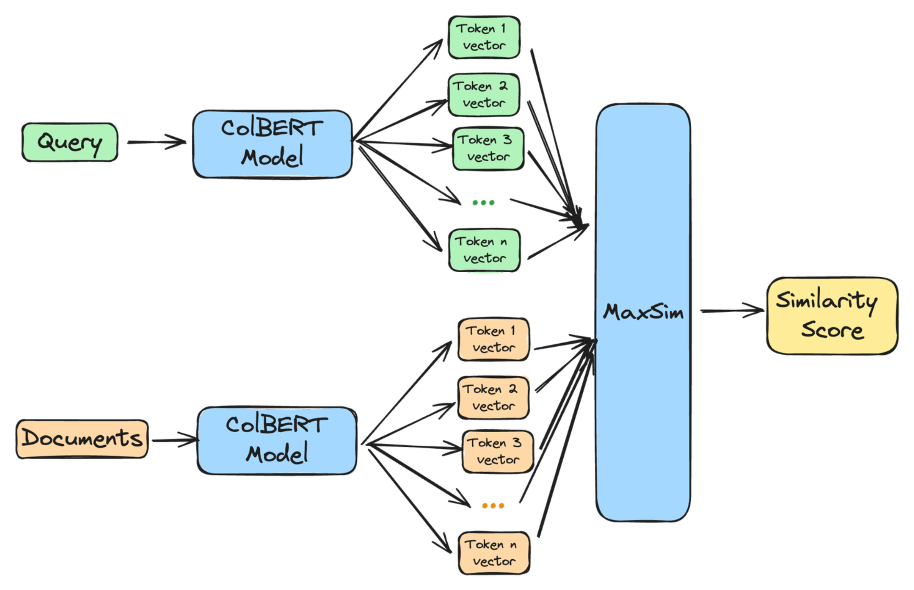
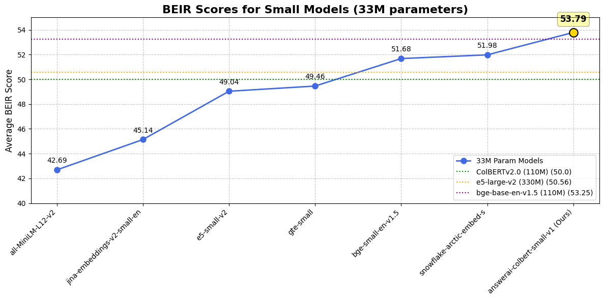
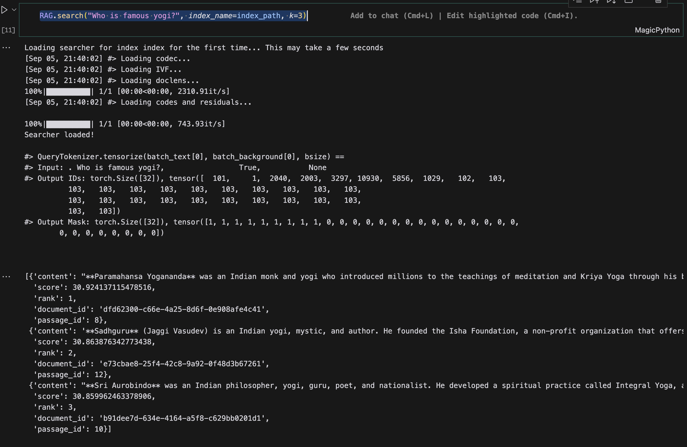
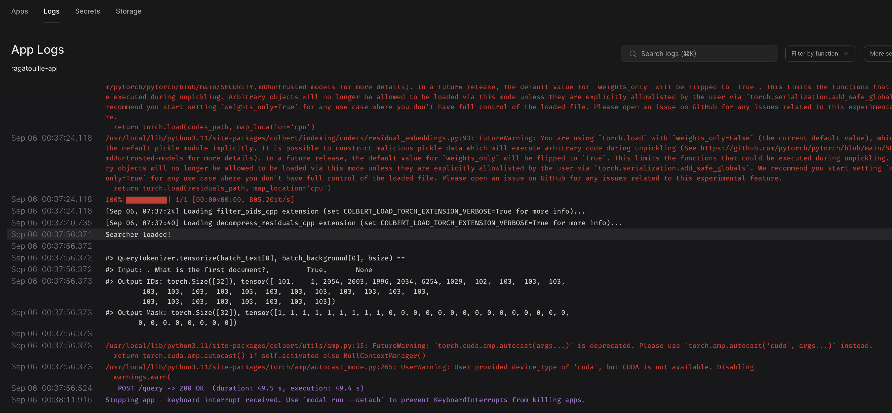

Hello Everyone,

In my work with information retrieval systems, I’ve often come across a dilemma: should I use **dense embeddings** or **sparse embeddings**?

Dense embeddings, created by transformer networks, capture the semantic meaning of text in compact, continuous vectors, which is incredibly powerful when we want to understand context and nuance. On the other hand, sparse embeddings, generated by methods like TF-IDF or BM25, focus on the presence of specific words or terms, making them better at pinpointing exact matches.

The ideal solution would combine the strengths of both. We want the broad understanding of dense embeddings and the precise keyword matching of sparse embeddings.

That’s where [ColBERT](https://huggingface.co/colbert-ir/colbertv2.0) (Contextualized Late Interaction over BERT) comes into play, and I think it’s a game-changer. ColBERT offers the best of both worlds by using dense embeddings while also preserving some of the precision we see with sparse methods. What makes ColBERT unique is its late interaction mechanism, which allows it to perform more detailed, term-level matching after generating embeddings, unlike standard dense models that blend everything upfront. And its downloaded over [**4.5M**](https://huggingface.co/colbert-ir/colbertv2.0) times in last month on huggingface🤯.



ColBERT excels at understanding the context of a query while also ensuring that important keywords are considered. This makes it a powerful tool for various tasks, from analyzing contracts to searching technical documents, as it offers both a deep understanding of meaning and precise keyword matching.

## Discovering [RAGatouille](https://github.com/AnswerDotAI/RAGatouille): Making ColBERT Accessible

About six months ago, I was introduced to a tool called RAGatouille by [Simon Wilson](https://github.com/simonw/til/blob/main/llms/colbert-ragatouille.md), and it sent me down a rabbit hole of learning about ColBERT. What’s exciting about RAGatouille is that it makes working with ColBERT so much easier. Instead of dealing with the complexity of training a retrieval model from scratch, RAGatouille simplifies the entire process, allowing me to implement cutting-edge retrieval methods in just a few lines of code.

RAGatouille simplifies data preparation for training and easily handles large datasets. It automatically structures training data and compresses indices for storage.

And the best part? It’s super easy to implement. You can get [ColBERT](https://docs.google.com/presentation/d/1Zczs5Sk3FsCO06ZLDznqkOOhbTe96PwJa4_7FwyMBrA/edit#slide=id.p) up and running in your retrieval pipeline with just a few lines of code, thanks to the streamlined design of RAGatouille. There’s even a [lite version coming soon](https://x.com/bclavie), which promises to make things even more lightweight and user-friendly.

In the next section, I’ll dive into how to use RAGatouille to build and query a ColBERT index, showing you how quickly you can start improving your retrieval tasks with this powerful tool.

### Install RAGatouille

I prefer to use `uv` for package installations these days. It's a great tool, and I highly recommend giving it a try if you haven't already. Installing `uv` is straightforward: simply use `pip install uv`, just like installing Chrome on a new Windows laptop.

```bash
uv pip install ragatouille
```

I have been running this on my local mac, if you have gpu its even more faster.

### ColBERT Model Sizes: A Tale of Two Models

When it comes to ColBERT, you have options! The original ColBERTv2 model boasts around 110 million parameters, making it a medium-sized player in the embedding world.

However, a newer, leaner ColBERT model has entered the scene: ["answerai-colbert-small-v1"](https://www.answer.ai/posts/2024-08-13-small-but-mighty-colbert.html). This compact version weighs in at just 33 million parameters, falling within the "MiniLM-size range" – what we usually consider "small" for embedding models.



The smaller 33M parameter ColBERT model offers significant advantages:

* **Faster Training:** It trains much quicker, speeding up experimentation.
* **Faster Queries:** Enjoy rapid query responses, ideal for most use cases.
* **Easier Deployment:** Deploy on CPUs for inference, simplifying infrastructure.
* **Cheaper Fine-tuning:** Fine-tune it affordably, adapting it to your domain.
* **Strong Performance:** Despite its size, it often outperforms the larger 110M model. 

We will be using this model for our implementation today

### Building a ColBERT Index with RAGatouille

first thing first impport and downloading model from huggingface

```python
from ragatouille import RAGPretrainedModel
RAG = RAGPretrainedModel.from_pretrained("answerdotai/answerai-colbert-small-v1")
```

Now lets define sample docs. here we are using list but you can use any type of list documents here for indexing

```python
docs = [
    "Hayao Miyazaki is a Japanese director, born on January 5, 1941, in Tokyo, Japan. He is a co-founder of Studio Ghibli and is known for his works such as 'Spirited Away', 'My Neighbor Totoro', and 'Princess Mononoke'. Miyazaki is celebrated for his unique storytelling and animation style, which often includes themes of nature, pacifism, and feminism.",
    "Walt Disney is an American entrepreneur, animator, and film producer, born on December 5, 1901, in Chicago, Illinois. He is the co-founder of The Walt Disney Company and is best known for creating iconic characters like Mickey Mouse and producing classic animated films such as 'Snow White and the Seven Dwarfs', 'Cinderella', and 'The Lion King'. Disney's work has had a profound impact on the entertainment industry and popular culture.",
    "Isao Takahata was a Japanese director and producer, born on October 29, 1935, in Ise, Japan. He co-founded Studio Ghibli with Hayao Miyazaki and directed several critically acclaimed films, including 'Grave of the Fireflies', 'The Tale of the Princess Kaguya', and 'Only Yesterday'. Takahata's films are known for their emotional depth and social commentary.",
    "John Lasseter is an American animator, director, and producer, born on January 12, 1957, in Hollywood, California. He was a key figure in the development of computer-animated films and served as the Chief Creative Officer at Pixar and Walt Disney Animation Studios. Lasseter directed and produced several successful films, including 'Toy Story', 'A Bug's Life', and 'Cars'. His work has been instrumental in shaping the modern animation industry.",
    "Osamu Tezuka, often referred to as the 'God of Manga', was a Japanese manga artist, animator, and film producer, born on November 3, 1928, in Toyonaka, Japan. He is best known for creating the manga series 'Astro Boy', 'Black Jack', and 'Phoenix'. Tezuka's work laid the foundation for modern manga and anime, and he is credited with pioneering many of the techniques and conventions that are now standard in the industry.",
    "Chuck Jones was an American animator, director, and screenwriter, born on September 21, 1912, in Spokane, Washington. He is best known for his work on the Looney Tunes and Merrie Melodies series of cartoons, where he created iconic characters such as Bugs Bunny, Daffy Duck, and Wile E. Coyote. Jones's work is celebrated for its wit, humor, and innovative animation techniques.",
    "Mamoru Hosoda is a Japanese film director and animator, born on September 19, 1967, in Toyama, Japan. He is known for directing films such as 'The Girl Who Leapt Through Time', 'Summer Wars', and 'Wolf Children'. Hosoda's films often explore themes of family, technology, and the passage of time, and he is considered one of the leading figures in contemporary Japanese animation.",
    "Glen Keane is an American animator, author, and illustrator, born on April 13, 1954, in Philadelphia, Pennsylvania. He is best known for his work at Walt Disney Animation Studios, where he animated characters such as Ariel in 'The Little Mermaid', Beast in 'Beauty and the Beast', and Aladdin in 'Aladdin'. Keane's work is renowned for its expressiveness and emotional depth, and he has been a major influence on the field of character animation.",
    "**Paramahansa Yogananda** was an Indian monk and yogi who introduced millions to the teachings of meditation and Kriya Yoga through his book, 'Autobiography of a Yogi'. He established the Self-Realization Fellowship (SRF) to disseminate his teachings worldwide.",
    "**Swami Vivekananda** was a key figure in the introduction of Vedanta and Yoga to the Western world. He was a disciple of Ramakrishna Paramahamsa and is known for his inspiring lectures and speeches on spirituality and Indian philosophy.",
    "**Sri Aurobindo** was an Indian philosopher, yogi, guru, poet, and nationalist. He developed a spiritual practice called Integral Yoga, aiming for a divine life on earth. He also played a significant role in India's struggle for independence.",
    "**Ramana Maharshi** was an Indian Hindu sage who advocated for self-enquiry as the principal means to achieve liberation. He is known for his teachings on Advaita Vedanta and his simple yet profound approach to spirituality.",
    "**Sadhguru** (Jaggi Vasudev) is an Indian yogi, mystic, and author. He founded the Isha Foundation, a non-profit organization that offers yoga programs around the world and is involved in social outreach, education, and environmental initiatives." 
]
```

Now lets index the data. indexing is very easy with ragatouille in single line you can create a local index

```python
index_path = "index"
RAG.index(
    collection=docs,
    index_name=index_path,
    max_document_length=512,
    split_documents=True,
    # use_faiss=True, # use only when you can sure that faiss is working on your system
)
```

As you can see, we've used `split_documents=True`. This splits documents into smaller chunks to fit the model's input size, which is helpful for large documents.  We've also set `max_document_length=512`, which controls the maximum size of these chunks.

Now, let's preload the saved index and query it.

```python
RAG = RAGPretrainedModel.from_index(".ragatouille/colbert/indexes/index")
RAG.search("Who is famous yogi?", index_name=index_path, k=3)
```

This should return the top 3 documents from the indexed documents.


In just a few lines of code, you have implemented a ColBERT model with Ragatouille. This demonstrates how easy it is to use ColBERT with Ragatouille.

However, there are no guides to how put this in production. So here we go, we will be creating fast api server to serve this model first and we will also use some modification to deploy the same server on modal labs.

### FastAPI Server for ColBERT

Lets get started with fastapi server. First we will install fastapi and uvicorn

```bash
uv pip install fastapi uvicorn
```

Now lets create a server file `server.py` and add the following code

```python
from fastapi import FastAPI, HTTPException
from pydantic import BaseModel
from typing import List
from ragatouille import RAGPretrainedModel
```

We would be using best practice of fast api and create a pydantic model for our request and response

```python
class Query(BaseModel):
    text: str
    k: Optional[int] = 1 # default k=1

class Response(BaseModel):
    answer: List

class Document(BaseModel):
    id: str
    text: str

class IndexRequest(BaseModel):
    index_name: str
    documents: List[Document]

class IndexResponse(BaseModel):
    message: str
    index_path: str
```

We have created 5 pydantic objects:

1. `Query`: This object represents the query that the user will send to the server. It has a single field `text` which is the query string.
2. `Response`: This object represents the response that the server will send back to the user. It has a single field `answer` which is the answer to the query.
3. `Document`: This object represents a document that will be indexed. It has two fields `id` which is the unique identifier of the document and `text` which is the text of the document.
4. `IndexRequest`: This object represents the request to index a set of documents. It has two fields `index_name` which is the name of the index and `documents` which is a list of `Document` objects.
5. `IndexResponse`: This object represents the response to the index request. It has two fields `message` which is a message indicating whether the indexing was successful and `index_path` which is the path to the index.


Now lets create create index endpoint,

```python
@app.post("/create_index", response_model=IndexResponse)
async def create_index_endpoint(request: IndexRequest):
    try:
        docs = [{"id": doc.id, "text": doc.text} for doc in request.documents]
        rag = RAGPretrainedModel.from_pretrained("answerdotai/answerai-colbert-small-v1")
        docs = [doc.text for doc in request.documents]
        rag.index(
            collection=docs,
            index_name=request.index_name,
            max_document_length=512,
            split_documents=True,
             # use_faiss=True, # use only when you can sure that faiss is working on your system
        )
        return IndexResponse(
            message="Index created successfully",
            index_path=request.index_name
        )
    except Exception as e:
        raise HTTPException(status_code=500, detail=str(e))
```

This endpoint, which we can access through a POST request to `/create_index`, is designed to create a new index of documents using our RAG model.

It receives a list of documents, transforms them into the format our model expects, and then uses the `rag.index` function to actually build the index.

Finally we will implement query endpoint.

```python
@app.post("/query", response_model=Response)
async def query_endpoint(query: Query, index_name: str):
    try:
        rag = RAGPretrainedModel.from_index(f".ragatouille/colbert/indexes/{index_name}")
        results = rag.search(query.text, k=query.k)
        return Response(answer=results)
    except Exception as e:
        raise HTTPException(status_code=500, detail=str(e))

```

This endpoint, accessible via a POST request to `/query`, handles user queries against a specific index.

It takes the user's query and the name of the index to search as input. It then uses the `rag.search` function to retrieve the most relevant document from the specified index.

Finally, it extracts the text content of the most relevant result and returns it as the answer to the user's query.

to run this server we can create a `main.py` file and add the following code

```python
if __name__ == "__main__":
    import uvicorn
    uvicorn.run("server:app", host="0.0.0.0", port=8000)
```

Now you can run the server using the following command

```bash
python main.py
```

This will start the server on `http://0.0.0.0:8000`. You can test the endpoints using a tool like `curl` or `Postman`.

### Testing the Server

We can use requests library to test the server. Here is a sample test code for creating index and querying the index.

```python
import requests

def test_create_index():
    response = requests.post(
        "http://localhost:8000/create_index",
        json={
    "index_name": "my_index",
    "documents": [
        {"id": "doc1", "text": "**Paramahansa Yogananda** was an Indian monk and yogi who introduced millions to the teachings of meditation and Kriya Yoga through his book, 'Autobiography of a Yogi'. He established the Self-Realization Fellowship (SRF) to disseminate his teachings worldwide."},
        {"id": "doc2", "text": "**Swami Vivekananda** was a key figure in the introduction of Vedanta and Yoga to the Western world. He was a disciple of Ramakrishna Paramahamsa and is known for his inspiring lectures and speeches on spirituality and Indian philosophy."},
        {"id": "doc3", "text": "**Sri Aurobindo** was an Indian philosopher, yogi, guru, poet, and nationalist. He developed a spiritual practice called Integral Yoga, aiming for a divine life on earth. He also played a significant role in India's struggle for independence."},
        {"id": "doc4", "text": "**Ramana Maharshi** was an Indian Hindu sage who advocated for self-enquiry as the principal means to achieve liberation. He is known for his teachings on Advaita Vedanta and his simple yet profound approach to spirituality."},
        {"id": "doc5", "text": "**Sadhguru** (Jaggi Vasudev) is an Indian yogi, mystic, and author. He founded the Isha Foundation, a non-profit organization that offers yoga programs around the world and is involved in social outreach, education, and environmental initiatives."} 
    ]
    },
    )
    assert response.status_code == 200
    assert response.json()["message"] == "Index created successfully"

def test_query_index():
    response = requests.post(
        "http://localhost:8000/query",
        json={"text": "What is the first document?", "k": 3},
        params={"index_name": "my_index"},
    )
    print(response.json())
    assert response.status_code == 200
```

This was easy to create, right? Now let's deploy it on Modal Labs!  ColBERT's speed relies on GPUs, and Modal's serverless GPU setup is perfect for it. I chose Modal because it's super easy to deploy, offers various GPU options like A100s, automatically scales to handle demand, and is cost-effective since I only pay for what I use. Plus, it's fast and flexible, letting me focus on my code instead of infrastructure. 

Let's first install Modal on your system using pip:

```bash
uv pip install modal
```
Make sure you do necessary setup and create account on modal labs. here is the [link](https://modal.com/docs)

to use our FastAPI server inside Modal, we need to make some necessary changes to our `server.py` file. We'll create a new file, `modal_server.py`, and add the following code.


What are changes we need to make in our server.py file to make it work on modal labs?

Let's break down the changes we need to make to our `server.py` file to deploy it on Modal Labs.

**1. Importing Modal:**

We start by importing the `modal` library, which provides the tools for interacting with Modal's platform.

```python
import modal
```

**2. Defining a Modal Image:**

Next, we define a Modal image. This image will encapsulate our application's environment, including Python and the necessary libraries. We'll use a Debian Slim base image with Python 3.11 and install `fastapi`, `pydantic`, and `ragatouille` using `pip_install`. Additionally, we'll install `git` using `apt_install`.

To optimize performance and reduce cold start times, we'll download the required NLTK data and the RAG model during the image build process. This is achieved by defining two custom functions, `download_nltk_data` and `download_model`, and then using `run_function` to execute them within the image definition. By doing so, these resources will be readily available when the application starts, eliminating the need to download them at runtime.

```python
def download_nltk_data():
    import nltk
    nltk.download('punkt')


def download_model():
    from ragatouille import RAGPretrainedModel
    rag = RAGPretrainedModel.from_pretrained("answerdotai/answerai-colbert-small-v1")

# Create an ima
image = (
    modal.Image.debian_slim(python_version="3.11")
    .pip_install("fastapi", "pydantic", "ragatouille")
    .apt_install("git")
    .run_function(download_nltk_data)
    .run_function(download_model)
)
```

**3. Creating a Modal Volume:**

We'll create a Modal volume to persistently store our RAG indexes. This ensures that our indexes are not lost between function invocations.

```python
volume = modal.Volume.from_name("ragatouille-indexes", create_if_missing=True)
```

**4. Defining a Modal App:**

We define a Modal app named `ragatouille-api`, associating it with the image and volume we created. This app will serve as the container for our FastAPI server.

```python
app = modal.App("ragatouille-api", image=image,volumes={"/ragatouille_indexes": volume})
```

**5. Decorating Endpoints with `@app.function`:**

We decorate our `create_index_endpoint` and `query_endpoint` with `@app.function`. This tells Modal that these functions should be executed as serverless functions within our Modal app. We specify the image to use, the GPU type ("T4" in this case), and a timeout for the functions.

```python
@app.function(image=image, timeout=3600)
@app.post("/create_index", response_model=IndexResponse)
async def create_index_endpoint(request: IndexRequest):

@app.function(image=image, timeout=3600)
@app.post("/query", response_model=Response)
async def query_endpoint(query: Query, index_name: str):

```

**6. Creating an ASGI App:**

We define a function `fastapi_app` decorated with `@app.function` and `@modal.asgi_app()`. This function returns our FastAPI app instance, making it accessible as an ASGI application within Modal.

```python
@app.function(image=image)
@modal.asgi_app()
def fastapi_app():
    return app
```

**Putting it all together, here's the complete code for `modal_server.py`:**


```python
from fastapi import FastAPI, HTTPException
from pydantic import BaseModel
from typing import List, Optional
from ragatouille import RAGPretrainedModel
# Import modal
import modal

def download_nltk_data():
    import nltk
    nltk.download('punkt')


def download_model():
    from ragatouille import RAGPretrainedModel
    rag = RAGPretrainedModel.from_pretrained("answerdotai/answerai-colbert-small-v1")

image = (
    modal.Image.debian_slim(python_version="3.11")
    .pip_install("fastapi", "pydantic", "ragatouille")
    .apt_install("git")
    .run_function(download_nltk_data)
    .run_function(download_model)
)
# Create a Modal volume to store indexes
volume = modal.Volume.from_name("ragatouille-indexes", create_if_missing=True)
app = modal.App("ragatouille-api", image=image,volumes={"/ragatouille_indexes": volume})

fast_app = FastAPI()

class Query(BaseModel):
    text: str
    k: Optional[int] = 1 # default k=1

class Response(BaseModel):
    answer: List

class Document(BaseModel):
    id: str
    text: str

class IndexRequest(BaseModel):
    index_name: str
    documents: List[Document]

class IndexResponse(BaseModel):
    message: str
    index_path: str

# Initialize the RAG model

@app.function(image=image, timeout=3600)
@fast_app.post("/create_index", response_model=IndexResponse)
async def create_index_endpoint(request: IndexRequest):
    try:
        #  Remove print statements
        #  print("Received request:", request)
        #  print("Request type:", type(request))
        #  print("Documents:", request.documents)
        #  print("First document type:", type(request.documents[0]) if request.documents else "No documents")
        docs = [{"id": doc.id, "text": doc.text} for doc in request.documents]
        rag = RAGPretrainedModel.from_pretrained("answerdotai/answerai-colbert-small-v1")
        docs = [doc.text for doc in request.documents]
        rag.index(
            collection=docs,
            index_name=request.index_name,
            max_document_length=512,
            split_documents=True,
             use_faiss=True, # use only when you can sure that faiss is working on your system
        )
        return IndexResponse(
            message="Index created successfully",
            index_path=request.index_name
        )
    except Exception as e:
        # Remove print statements
        # print(e)
        raise HTTPException(status_code=500, detail=str(e))

@app.function(image=image, timeout=3600)
@fast_app.post("/query", response_model=Response)
async def query_endpoint(query: Query, index_name: str):
    try:
        # Remove print statements
        # print("Received query:", query)
        # print("Index name:", index_name)
        rag = RAGPretrainedModel.from_index(f".ragatouille/colbert/indexes/{index_name}")
        results = rag.search(query.text, k=query.k)
        return Response(answer=results)
    except Exception as e:
        raise HTTPException(status_code=500, detail=str(e))

@app.function(image=image)
@modal.asgi_app()
def fastapi_app():
    return fast_app
```



You can test this by running the following command:

```bash
modal serve modal_server.py
```

Then, replace `localhost` in your API requests with your Modal endpoint. For example, my endpoint is:
`<username>--ragatouille-api--fastapi-app-dev.modal.run`
Replace `<username>` with your Modal username.

And that's it! You've successfully deployed your FastAPI server with ColBERT on Modal Labs. You can now use this server to create and query indexes with RAGatouille.

## Conclusion

This post showed how to use ColBERT and RAGatouille for information retrieval. We deployed our system on Modal Labs to make it faster and easier to scale. While we wanted to use Modal's GPUs, we ran into some issues and used CPUs instead. We'll discuss these challenges in a future post.

This setup offers a robust and efficient solution for various information retrieval tasks, particularly when dealing with large datasets and complex queries. Whether your focus is semantic search, question answering, or other applications demanding advanced retrieval capabilities, the combination of ColBERT, RAGatouille, and Modal Labs can significantly enhance your workflow.

I encourage you to experiment with this setup and discover the possibilities it unlocks for your information retrieval projects. Feel free to reach out if you have any questions or want to share your experiences. Happy coding!

Code can be found [here](https://github.com/jayshah5696/til/tree/main/colbert/ragatouillie)

**P.S.** 
Remember that deploying a FastAPI server without authentication in a production environment is not recommended. Consider integrating authentication mechanisms, such as those provided by `fastapi-auth`, to secure your application. You can find more information on FastAPI authentication in the [official documentation](https://fastapi.tiangolo.com/tutorial/security/).

### References

1. **ColBERT Hugging Face Model:** [ColBERT](https://huggingface.co/colbert-ir/colbertv2.0)
2. **Simon Wilson's ColBERT with RAGatouille TIL:** [Simon Wilson](https://github.com/simonw/til/blob/main/llms/colbert-ragatouille.md)
3. **RAGatouille Lite Version Announcement:** [lite version coming soon](https://x.com/bclavie)
4. **AnswerAI's Small ColBERT Model Blog Post:** ["answerai-colbert-small-v1"](https://www.answer.ai/posts/2024-08-13-small-but-mighty-colbert.html)
5. **Code Repository for this Blog Post:** [Code Implementation](https://github.com/jayshah5696/til/tree/main/colbert/ragatouillie)
6. **Modal Labs Documentation:** [Modal Docs](https://modal.com/docs)
7. **FastAPI Authentication Documentation:** [FastAPI Security](https://fastapi.tiangolo.com/tutorial/security/)
8. **Interesting Talk on Colbert:** [Ben Clavie's Talk](https://docs.google.com/presentation/d/1Zczs5Sk3FsCO06ZLDznqkOOhbTe96PwJa4_7FwyMBrA/edit#slide=id.p)
