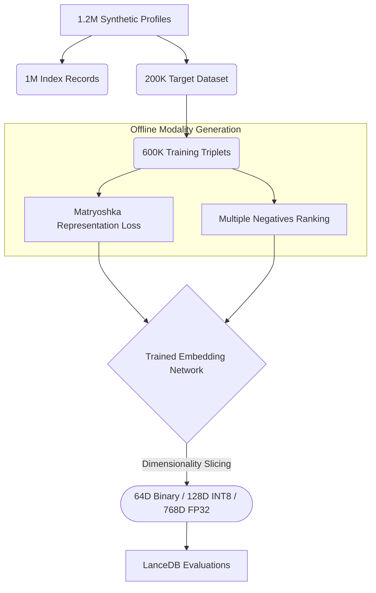

## Introduction

BM25 is fast, cheap, and completely fails when a user drops a single letter in a B2B contact search.

Dense retrieval fixes the typo problem. But scaling 768-dimensional vectors to 500 million records demands 1.5TB of RAM. Is the memory cost worth the accuracy? We built a 1M-record evaluation sweep to test if applying Matryoshka Representation Learning (MRL) to tabular entity data could bridge this cost gap, compressing embeddings enough to remain operational while still beating BM25 on corrupted queries.

*(Before we dive into the numbers: all the code, synthetic data generation scripts, and infrastructure configurations discussed in this post are completely open source. You can find the full implementation in the [`entity-resolution-poc` GitHub repository](https://github.com/jayshah5696/entity-resolution-poc).)*

Entity resolution is the task of consistently identifying real-world people across massive databases. It is a fundamental retrieval challenge. The standard approach relies heavily on lexical algorithms like BM25 via [Elasticsearch](https://www.elastic.co/). Elasticsearch offers tools like fuzziness to combat typos, but applying fuzzy matching across a 500 million row B2B contact database introduces high query latency and cascades false positives. Practically, engineers depend heavily on strict lexical evaluation on constrained schemas. Searching for an abbreviated "Jon" entirely misses the canonical "Jonathan". Searching using a personal Gmail drops the corporate record containing a strict work domain.

A continuous dense representation naturally solves this by mapping records into a shared semantic space. This smoothly overcomes rigid lexical barriers. But deploying a true dense retrieval fallback pipeline imposes a strict memory requirement.

To accomplish this, we structured an end-to-end evaluation using efficient serverless infrastructure. Utilizing [Modal's](https://modal.com/) A10G infrastructure, we spun up five parallel training jobs instantly. The entire ablation sweep, encompassing all model sizes and parameter constraints, completed in under 60 minutes. The total bill? **Less than $15.** We then executed a comprehensive ablation study across [LanceDB](https://lancedb.com/), evaluating models, dimensions, and quantization formats.

## The approach: synthetic data and Matryoshka learning



Because testing on 500M real B2B contact records violates strict PII constraints, we engineered a deterministic pipeline to generate 1.2M synthetic profiles. This dataset structurally mirrors real-world entropy, injecting precise, quantifiable degradations across 600K triplet examples formatted as `(anchor_corrupted, positive_clean, negative_hard)`.

Crucially, we evaluate not against a single baseline, but across five carefully selected architectures evaluated against BM25:
1. **Model Baselines:** `all-MiniLM-L6-v2` (22M), `bge-small-en-v1.5` (33M)
2. **Modern Architectures:** `gte-modernbert-base` (149M), `nomic-embed-text-v1.5` (137M)
3. **SOTA Reference:** `pplx-embed-v1-0.6b` (600M)

For efficient evaluation, we require a model that maintains semantic fidelity at radically truncated dimensions. We use **Matryoshka Representation Learning (MRL)**, wrapped around a Multiple Negatives Ranking Loss (MNRL) objective. This constraint forces the model to encode early dimensions with outsized semantic gravity.

We structured the profiles into a minimal positional string format before encoding. A clean `pristine` profile looks like this:

```text
Jonathan Smith | Google Inc | jonathan.smith@google.com | USA
```

During training and evaluation, we generated severe data variations based on six strict rules. Below are three actual examples from the resulting data triplet pipeline indicating how the dataset was structured organically:

| Anchor Input (Query) | Positive Target (True Match) | Negative Sample (Curriculum) | Error Type |
|:---|:---|:---|:---|
| Britzayn \| Johnson \| Robinson PLC \| brittany.johnson@protonmail.com \| USA | Brittany \| Johnson \| Robinson PLC \| brittany.johnson@protonmail.com \| USA | Jocelyn \| Gibson \| Robinson-Ballard \| jgibson@robinson-ballard.com \| USA | Typo Name + Same Prefix |
| Paige \| Freeman \| Johnson, Jones and Welch \| paige.freeman@outlook.com \| Brazil | P. \| Freeman \| Johnson, Jones and Welch \| paige.freeman@outlook.com \| Brazil | | Abbreviated Name |
| Adriana \|  \| Brown-Fry \| agutierrez@brown-fry.com \| UK | Adriana \| Gutierrez \| Brown-Fry \| agutierrez@brown-fry.com \| UK | | Missing Attributes |

We fine-tuned the dense models using a generated triplets dataset comprising an anchor, a positive canonical match, and hard negative samples drawn dynamically via structural curriculum learning.

To solve the 1.5TB memory problem optimally, we wrapped the base models in **MatryoshkaLoss** during training. This forces the model to encode semantic value hierarchically, allowing us to truncate dimensions at inference time without retraining.

Here is the exact PyTorch / SentenceTransformers setup we used to define the loss configuration:

```python
from sentence_transformers import losses

# We want the model to be proficient at all these dimensional scales simultaneously
matryoshka_dims = [768, 512, 256, 128, 64]

# Step 1: Base Loss (Multiple Negatives Ranking Loss leverages in-batch negatives)
inner_train_loss = losses.MultipleNegativesRankingLoss(model)

# Step 2: Wrap it in MatryoshkaLoss to sum gradients across all specified dimensions
train_loss = losses.MatryoshkaLoss(
    model, 
    inner_train_loss, 
    matryoshka_dims=matryoshka_dims
)
```

Spinning up robust distributed remote infrastructure is a must when running sweeping ablations like this. Fine-tuning all five pipelines concurrently on [Modal](https://modal.com/) A10G GPUs took exactly 60 minutes and cost **less than $15 in total compute.**


*Figure: The Modal billing dashboard demonstrating the $14.50 cost for training all constraints simultaneously.*

## Evaluating accuracy across degradations

We measured both Recall@10 (the proportion of queries where the canonical record appears in the top 10 results) and Mean Reciprocal Rank (MRR@10). While BM25 provides an incredibly strong baseline on exact lexical overlaps, our evaluation focuses on model behavior when the signal text is heavily degraded.


*Figure 1: Model performance (Overall MRR@10) across the six corruption buckets.*

### 1. GTE-ModernBERT Dominates Heavily Corrupted Queries

BM25 yields perfect recall on pristine queries, but its performance strongly correlates with token similarity, leading to significant drops when attributes are removed.

When the profile omits the email and company entirely, BM25 Recall@10 drops to 0.750. This is where the **fine-tuned GTE-ModernBERT (149M)** excels, driving the Recall to 0.798 (a +4.8pp jump) while simultaneously returning near-perfect exact matching across cleanly formed buckets.

Overall, the customized GTE-ModernBERT delivers an 0.966 global Recall@10, beating the 0.958 baseline set by BM25. Interestingly, its global MRR@10 (0.917) exactly matches BM25, proving it retrieves the right semantic candidates into the top slot as reliably as a rigid string match.


*Figure 2: Global MRR@10 metrics across all distinct models. Notice the vast gap between base and fine-tuned configurations for the smaller models.*

### Catastrophic forgetting in rigid architectures

Fine-tuning the 137M parameter `nomic-v1.5` architecture presented a unique catastrophic forgetting challenge.

Nomic-v1.5 natively relies on rigid instruction prefixes (like `search_query: `) positioned structurally to route queries and documents into distinct vector endpoints. When we subjected it to standard **MNRL** targeting short structured strings, the optimizer shattered the foundational representations. The model outright collapsed handling partial queries, dropping from 48.8% Recall@10 down to 15.2% on missing field subsets. Its overall MRR@10 dropped from 0.850 (zero-shot) to 0.795 post fine-tuning.

### Table 1: Base Architecture Capabilities (FP32/None, Maximum Dimensions)

Here are the uncompressed Maximum-Dimensional configurations (e.g. 768D FP32) tracking zero-shot performance directly against fine-tuned model adaptations.

| Model | Mode | Dims | FP32 (MRR \| Size) | INT8 (MRR \| Size) | Binary (MRR \| Size) |
|-------|------|------|--------------------|--------------------|----------------------|
| `bge_small` | Zero-Shot | 384 | 0.844 \| 1616.8MB | 0.875 \| 1726.2MB | 0.868 \| 1680.4MB |
| `minilm_l6` | Zero-Shot | 384 | 0.840 \| 1616.8MB | 0.856 \| 1726.2MB | 0.852 \| 1680.4MB |
| `gte_modernbert` | Zero-Shot | 768 | 0.891 \| 3105.3MB | 0.904 \| 3283.9MB | 0.903 \| 3192.3MB |
| `nomic_v15` | Zero-Shot | 768 | 0.850 \| 3105.3MB | 0.861 \| 3283.9MB | 0.862 \| 3192.3MB |
| `bge_small` | Fine-Tuned | 384 | 0.898 \| 1616.8MB | 0.906 \| 1726.2MB | 0.906 \| 1680.4MB |
| `minilm_l6` | Fine-Tuned | 384 | 0.895 \| 1616.8MB | 0.902 \| 1726.2MB | 0.902 \| 1680.4MB |
| `gte_modernbert` | Fine-Tuned | 768 | 0.917 \| 3105.3MB | 0.927 \| 3283.9MB | 0.927 \| 3192.3MB |
| `nomic_v15` | Fine-Tuned | 768 | 0.795 \| 3104.9MB | - | - |

The smaller models benefit massively from the domain adaptation. `bge_small` jumps from 0.844 to 0.898 MRR, and `minilm_l6` climbs from 0.840 to 0.895.

## Solving system pragmatics: compression and index scaling

Dense vectors carry strict search overhead. BM25 yields p50 latencies around 3.25ms against the 1M record dataset. The primary victor (GTE-ModernBERT) averages 24.12ms p50 latency and requires over 3.1GB per million records.

To compress index footprint, we scaled the representations down directly at index time using our Matryoshka training. By querying LanceDB mathematically truncated and quantized, we avoided re-running the heavy neural encoding for the ablation.


*Figure 3: Ablation tracking dimensionality versus MRR@10 using BGE-Small.*

Using BGE-Small and MiniLM, we saw binary embeddings collapse below 128 dimensions. But INT8 models held steady, matching the performance of their wider counterparts.

### The Pareto victor: MiniLM-L6 at 128D (INT8)

At inference time, accuracy is only one axis of the problem. Latency and memory load govern operational limits.


*Figure 4: The latency-MRR Pareto frontier for fine-tuned dense retrievers vs. BM25.*

We observed that **fine-tuned MiniLM-L6 mapped to a 128-INT8 configuration** returned results in 6.79ms (p50) and compressed the index to under 700MB.

Despite extreme volume compression, it holds a resilient 0.934 Recall@10 globally. This condenses the required 500M scale index from 1.5TB down to roughly 350GB, moving it firmly into operational viability.


*Figure 5: Overall Recall@10 by Model and Mode. Fine-tuning pushes the tiny 22M parameter MiniLM-L6 (0.928) perilously close to the zero-shot baseline of the 149M ModernBERT (0.941).*

## Final thoughts

Entity resolution on real-world data requires models that are robust to missing or inherently noisy attribute fields. Dense retrieval models elegantly solve the lexical mismatch problem, but their infrastructure footprint is often prohibitive at production scales.

By applying Matryoshka learning and INT8 quantization to small models like MiniLM-L6, we proved we can bridge the cost gap. This allows engineering teams to deploy highly resilient vector pipelines for entity resolution that remain memory-compliant without surrendering accuracy. You can indeed beat BM25 at scale, and the cost is entirely manageable if you compress correctly.

Next time you hit a problem where text matches fail but semantic size is too heavy, consider fine-tuning a small model and deriving quantized outputs from a Matryoshka manifold.

These resulting fine-tuned checkpoints are public on HuggingFace:
- [`jayshah5696/er-gte-modernbert-base-pipe-ft`](https://huggingface.co/jayshah5696/er-gte-modernbert-base-pipe-ft)
- [`jayshah5696/er-bge-small-pipe-ft`](https://huggingface.co/jayshah5696/er-bge-small-pipe-ft)
- [`jayshah5696/er-minilm-l6-pipe-ft`](https://huggingface.co/jayshah5696/er-minilm-l6-pipe-ft)

For the full detailed ablation pipeline, including the direct LanceDB configurations—check out the [`entity-resolution-poc`](https://github.com/jayshah5696/entity-resolution-poc) source tree on our GitHub.
## Appendix: Comprehensive Ablation Grids

The following tables present the full ablation results for Matryoshka dimensions against quantization levels, grouping the key metrics side-by-side to allow for direct evaluation of compression tradeoffs.

### Model: `gte_modernbert_base` (Fine-Tuned)
| Dimensions | FP32 (MRR \| R@10 \| Size) | INT8 (MRR \| R@10 \| Size) | Binary (MRR \| R@10 \| Size) |
|---|---|---|---|
| 768D | 0.917 \| 0.966 \| 3105.3MB | **0.927** 🏆 \| 0.975 \| 3283.9MB | 0.927 \| 0.974 \| 3192.3MB |
| 512D | 0.915 \| 0.964 \| 2154.1MB | 0.926 \| 0.973 \| 2245.7MB | 0.925 \| 0.973 \| 2184.7MB |
| 256D | 0.907 \| 0.953 \| 1161.3MB | 0.923 \| 0.970 \| 1207.1MB | 0.920 \| 0.967 \| 1176.6MB |
| 128D | 0.892 \| 0.935 \| 665.2MB | 0.916 \| 0.962 \| 688.0MB | 0.910 \| 0.956 \| 672.8MB |
| 64D | 0.866 \| 0.905 \| *417.1MB* ⚡ | 0.907 \| 0.951 \| *428.5MB* ⚡ | 0.896 \| 0.938 \| *420.9MB* ⚡ |

### Model: `gte_modernbert_base` (Zero-Shot)
| Dimensions | FP32 (MRR \| R@10 \| Size) | INT8 (MRR \| R@10 \| Size) | Binary (MRR \| R@10 \| Size) |
|---|---|---|---|
| 768D | 0.891 \| 0.941 \| 3105.3MB | **0.904** 🏆 \| 0.948 \| 3283.9MB | 0.903 \| 0.948 \| 3192.3MB |
| 512D | 0.883 \| 0.935 \| 2154.1MB | 0.903 \| 0.947 \| 2245.7MB | 0.900 \| 0.946 \| 2184.7MB |
| 256D | 0.859 \| 0.911 \| 1161.3MB | 0.891 \| 0.935 \| 1207.1MB | 0.885 \| 0.931 \| 1176.6MB |
| 128D | 0.816 \| 0.871 \| 665.2MB | 0.877 \| 0.918 \| 688.0MB | 0.862 \| 0.907 \| 672.8MB |
| 64D | 0.705 \| 0.786 \| *417.1MB* ⚡ | 0.841 \| 0.881 \| *428.5MB* ⚡ | 0.809 \| 0.855 \| *420.9MB* ⚡ |

### Model: `nomic_v15` (Fine-Tuned)
| Dimensions | FP32 (MRR \| R@10 \| Size) | INT8 (MRR \| R@10 \| Size) | Binary (MRR \| R@10 \| Size) |
|---|---|---|---|
| 768D | 0.795 | 0.817 | 3104.9MB | - | - |

### Model: `nomic_v15` (Zero-Shot)
| Dimensions | FP32 (MRR \| R@10 \| Size) | INT8 (MRR \| R@10 \| Size) | Binary (MRR \| R@10 \| Size) |
|---|---|---|---|
| 768D | 0.850 \| 0.882 \| 3105.3MB | 0.861 \| 0.891 \| 3283.9MB | **0.862** 🏆 \| 0.893 \| 3192.3MB |
| 512D | 0.844 \| 0.877 \| 2154.1MB | 0.856 \| 0.886 \| 2245.7MB | 0.855 \| 0.887 \| 2184.7MB |
| 256D | 0.831 \| 0.864 \| 1161.3MB | 0.858 \| 0.889 \| 1207.1MB | 0.853 \| 0.884 \| 1176.6MB |
| 128D | 0.797 \| 0.839 \| 665.2MB | 0.852 \| 0.884 \| 688.0MB | 0.840 \| 0.872 \| 672.8MB |
| 64D | 0.655 \| 0.757 \| *417.1MB* ⚡ | 0.833 \| 0.865 \| *428.5MB* ⚡ | 0.797 \| 0.838 \| *420.9MB* ⚡ |

### Model: `bge_small` (Fine-Tuned)
| Dimensions | FP32 (MRR \| R@10 \| Size) | INT8 (MRR \| R@10 \| Size) | Binary (MRR \| R@10 \| Size) |
|---|---|---|---|
| 384D | 0.898 \| 0.932 \| 1616.8MB | 0.906 \| 0.941 \| 1726.2MB | 0.906 \| 0.940 \| 1680.4MB |
| 256D | 0.896 \| 0.930 \| 1161.3MB | **0.907** 🏆 \| 0.942 \| 1207.1MB | 0.906 \| 0.942 \| 1176.6MB |
| 128D | 0.885 \| 0.921 \| 665.2MB | 0.907 \| 0.943 \| 688.0MB | 0.902 \| 0.938 \| 672.8MB |
| 64D | 0.859 \| 0.894 \| *417.1MB* ⚡ | 0.902 \| 0.938 \| *428.5MB* ⚡ | 0.891 \| 0.926 \| *420.9MB* ⚡ |

### Model: `bge_small` (Zero-Shot)
| Dimensions | FP32 (MRR \| R@10 \| Size) | INT8 (MRR \| R@10 \| Size) | Binary (MRR \| R@10 \| Size) |
|---|---|---|---|
| 384D | 0.844 \| 0.894 \| 1616.8MB | **0.875** 🏆 \| 0.917 \| 1726.2MB | 0.868 \| 0.912 \| 1680.4MB |
| 256D | 0.831 \| 0.882 \| 1161.3MB | 0.872 \| 0.915 \| 1207.1MB | 0.861 \| 0.907 \| 1176.6MB |
| 128D | 0.798 \| 0.848 \| 665.2MB | 0.860 \| 0.902 \| 688.0MB | 0.844 \| 0.889 \| 672.8MB |
| 64D | 0.710 \| 0.771 \| *417.1MB* ⚡ | 0.828 \| 0.870 \| *428.5MB* ⚡ | 0.797 \| 0.841 \| *420.9MB* ⚡ |

### Model: `minilm_l6` (Fine-Tuned)
| Dimensions | FP32 (MRR \| R@10 \| Size) | INT8 (MRR \| R@10 \| Size) | Binary (MRR \| R@10 \| Size) |
|---|---|---|---|
| 384D | 0.895 \| 0.928 \| 1616.8MB | 0.902 \| 0.935 \| 1726.2MB | 0.902 \| 0.934 \| 1680.4MB |
| 256D | 0.892 \| 0.925 \| 1161.3MB | 0.901 \| 0.933 \| 1207.1MB | 0.900 \| 0.933 \| 1176.6MB |
| 128D | 0.881 \| 0.916 \| 665.2MB | **0.902** 🏆 \| 0.934 \| 688.0MB | 0.898 \| 0.931 \| 672.8MB |
| 64D | 0.855 \| 0.890 \| *417.1MB* ⚡ | 0.897 \| 0.929 \| *428.5MB* ⚡ | 0.886 \| 0.920 \| *420.9MB* ⚡ |

### Model: `minilm_l6` (Zero-Shot)
| Dimensions | FP32 (MRR \| R@10 \| Size) | INT8 (MRR \| R@10 \| Size) | Binary (MRR \| R@10 \| Size) |
|---|---|---|---|
| 384D | 0.840 \| 0.876 \| 1616.8MB | **0.856** 🏆 \| 0.891 \| 1726.2MB | 0.852 \| 0.887 \| 1680.4MB |
| 256D | 0.830 \| 0.867 \| 1161.3MB | 0.852 \| 0.887 \| 1207.1MB | 0.847 \| 0.882 \| 1176.6MB |
| 128D | 0.799 \| 0.839 \| 665.2MB | 0.844 \| 0.877 \| 688.0MB | 0.833 \| 0.866 \| 672.8MB |
| 64D | 0.713 \| 0.780 \| *417.1MB* ⚡ | 0.827 \| 0.860 \| *428.5MB* ⚡ | 0.802 \| 0.839 \| *420.9MB* ⚡ |

*(Note: BM25 Baseline achieved **0.917** MRR@10 with a **143.7MB** index).*

References:
- [1] [Matryoshka Representation Learning](https://arxiv.org/abs/2205.13147) Kusupati et al., 2022.
- [2] [Sentence-BERT: Sentence Embeddings using Siamese BERT-Networks](https://arxiv.org/abs/1908.10084) Reimers and Gurevych, 2019.
- [3] [GTE-ModernBERT Base](https://huggingface.co/Alibaba-NLP/gte-modernbert-base) Alibaba NLP.
- [4] [BGE Small En v1.5](https://huggingface.co/BAAI/bge-small-en-v1.5) BAAI.
- [5] [All-MiniLM-L6-v2](https://huggingface.co/sentence-transformers/all-MiniLM-L6-v2) Sentence Transformers.
- [6] [Nomic Embed Text v1.5](https://huggingface.co/nomic-ai/nomic-embed-text-v1.5) Nomic AI.
- [7] [LanceDB Documentation](https://lancedb.github.io/lancedb/) Vector database for scalable hybrid search.
- [8] [Modal Labs Documentation](https://modal.com/docs) Serverless GPU infrastructure.
